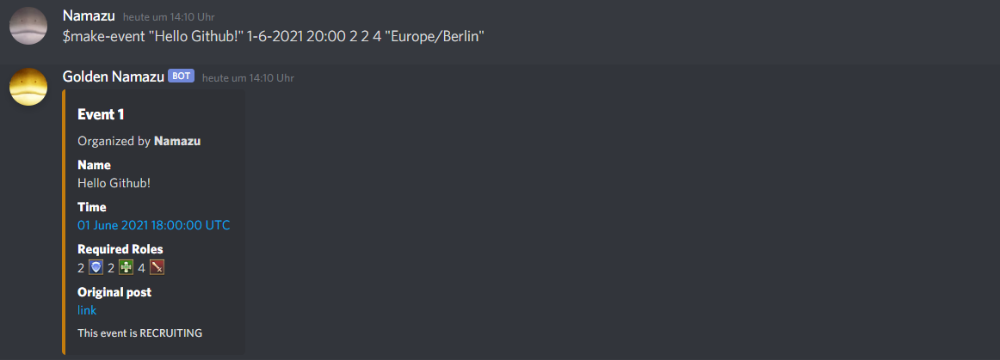
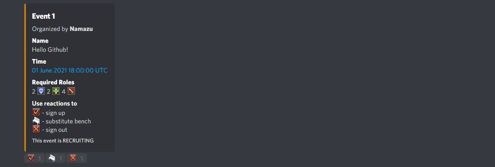
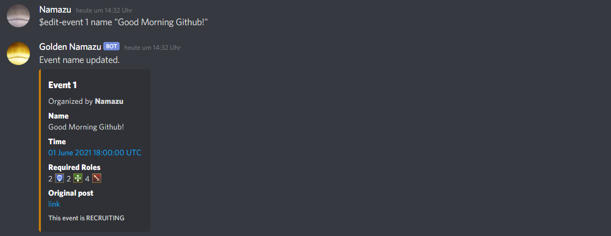
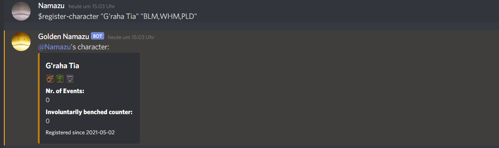
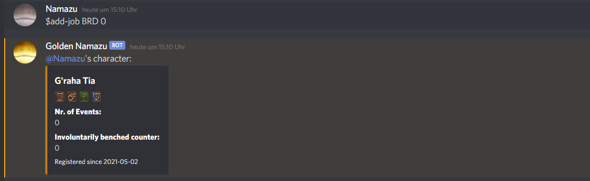
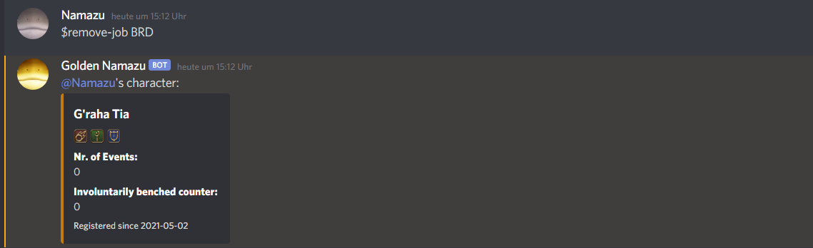
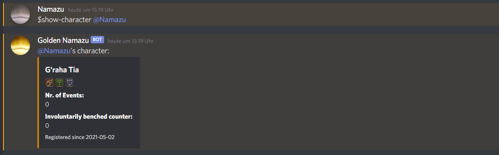

# FFXIV Event bot for Discord

This is the codebase for a discord bot to manage events like raids in the game FFXIV.
It is different from other bots in that it is built to allow people to register more than one job at a time,
which is a common thing to do in FFXIV. 

## Deployment

We don't support wide usage of the bot yet, so if you want to use it, you'd have to clone the repo and host the bot yourself.
With some further testing, we might be able to support a few more servers though, so you can also just contact us :)

## Intended Usage

Once the bot is part of your server, it will listen to any channel it is allowed to listen to.
What you want to do to not lose sight of your events is make an **event channel**.
You can also **make events** and **register characters** to take part in events.

## Event Channel

With `$set-event-channel <channel>`, you can set an event channel, to which all events are posted. 
This allows events to be found and reacted to easily. If you do not set an event channel, events will be posted in
the same channel as the command was used in and might be buried under other messages.

The `<channel>` parameter should be the discord link to a text channel on the server (e. g. `#event-channel`).

## Events
### Make Events:

You can create an event with `$make-event <name> <date> <start_time> <num_tanks> <num_heals> <num_dps> [user_timezone=UTC]`.

Parameters:

* `<name>` - Name of the event, choose something recognizable so people know what they sign up for.
* `<date>` - Date of the event, expected format is `dd-mm-yyyy` (sorry americans)
* `<start_time>` - Starting time of the event, expected format is `hh:mm` 
* `<num_tanks>` - Number of tanks required for this event (for standard 8 man raids that would be 2)
* `<num_heals>` - Number of healers required for this event (for standard 8 man raids that would be 2)
* `<num_dps>` - Number of dps required for this event (for standard 8 man raids that would be 4)
* `[user_timezone=UTC]` - Optional parameter to interpret the date and time parameter with the given timezone. 
Default is GMT/UTC, i. e. Server time.

The post below the command will show the event and link to the actual post on the **event channel**.

Now, registered users can sign in, put themselves on the bench, or sign out for the event.

* `sign up` - You sign up as your registered character for the event.
* `substitute bench` - You sign up as your registered character for the substitute bench. You will have a lower priority
when building the raid later and only participate if not enough people are signed in and/or you are required due 
to certain missing roles for the event.
* `sign out` - You can sign out for the event. Does nothing if you are not signed in or on the bench.

**NOTE:** The "Time" entry of this post will link to a website showing a countdown to the event time.
This is especially useful if timezone confusion happens a lot in your server.

### Edit Events:

You can edit events you have created with `$edit-event <ev_id> <field> <value>`.

Paramaters:

* `<ev_id>` - The id of the event to be changed. It's the number at the top of the event post.
* `<field>` - The thing you want to change about the event. Currently supports `name`, `date` and `time` of the event.
* `<value>` - The new value you want to set for the `<field>`.
* `[user_timezone=UTC]` - Optional parameter to interpret the time parameter with the given timezone. 
Default is GMT/UTC, i. e. Server time. Is ignored for other field types.

### Close Events:

Once you are done recruiting for an event you can close it with `$close-event <ev_id>`. Parameter `<ev-id>` is the 
event id as shown on the top of the event post.
Only the event organizer can close an event.

The bot will send you a dm with the options for the raid given the participants.
You can close the event with the following options:

* `CANCELLED` - Available if not enough people signed up or no viable raid could be built with the built-in logic. 
  Event will be cancelled and no one will be pinged.
* `UNDERSIZED` -  Available if not enough people signed up. 
  Everyone signed up will be set to participate and pinged.
* `MANUAL` - Available if no viable raid could be built with the built-in logic. Nobody will be pinged, all
messaging and recruiting has to be done manually.
* `COMPLETE` - Enough people are available, and you have chosen a composition. The chosen people will be pinged.

### Show events:

The command `$show-event <event_id>` will repost the information for the event including the link to the original
post to which you can react.

## Characters

The bot allows users to register one character per discord id. It will save the jobs for that character along with
the number of raids they have participated in and how many times they have been involuntarily put on the bench.

### Registration:

You can register a character with `$register-character <name> <job_list>`.

Parameters:

* `<name>` - Your characters name in the database and in events. Highly recommend putting a recognizable character
name here, but you are free to choose a nickname. If you want a space in your name you need to use quotation marks: 
  `"Firstname Lastname"`.
* `<job_list>` - The list of jobs you want to play in events in order of priority. That means the first job on that
list is the one you want to play the most, and the last job is the one you want to play the least. The bot expects
  a list separated by commas: `"JOB,JOB,JOB,JOB"`
  

If you want to register a different character, you can delete your character with `$delete-character`, but 
**beware this will delete your statistics!**

### Add/Remove Jobs:

You can add a job with `$add-job <job> <pos>`. Parameter `<pos>` is the position in the list you want the new job to
take. Position 0 is in front of all jobs.

You can remove a job with `$remove-job <job>`. 

### Show characters:

You can post the information for any discord users character by using `$show-character <discord_id>`. 
Parameter `<discord_id>` is supposed to be a ping to that discord user like `@nickname`.

### Change Name:

You can change the Nickname associated with your character with `$change-character-name <name>`, where `<name>` is the
new Name you want to give your Character. Remember to use quotation marks if you want to use spaces in you name, like
`"Firstname Lastname"`.

## Bonus Commands:

You can use `$help` to display the commands known to the bot with a short description.

If you use the `$hello` command, the bot will also say hello to you :)

The `$talkin-shit` command will make the bot post a gif that you might want to send to people that **are** talking
bad about you and/or the bot ;)
